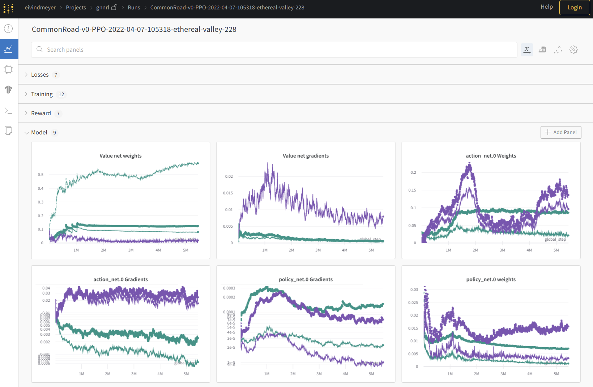

# Introduction

This repository contains high-level infrastructure code for training graph neural networks based on CommonRoad-Geometric.

---

## High-level crgeo architecture

---

## Weights & Biases Integration

**commonroad-geometric** offers a built-in **Weights & Biases** integration for metric tracking of deep learning experiments.

### Setup guide
1. Create your account at [https://wandb.ai/](https://wandb.ai/).
2. Create your project at Wandb and you should see a quickstart guide for pytorch.
3. Copy the **api key** give in the quickstart guide and set it as the environment variable *WANDB_API_KEY*.
4. Copy the **project name** and set it as the environment variable  *PROJECT_NAME*.
5. Finally, set the *ENTITY_NAME* environment variable with your username or in the case of service accounts, the name of the configured [service
account](https://docs.wandb.ai/guides/technical-faq#what-is-a-service-account-and-why-is-it-useful).

### Dashboard demo

---

